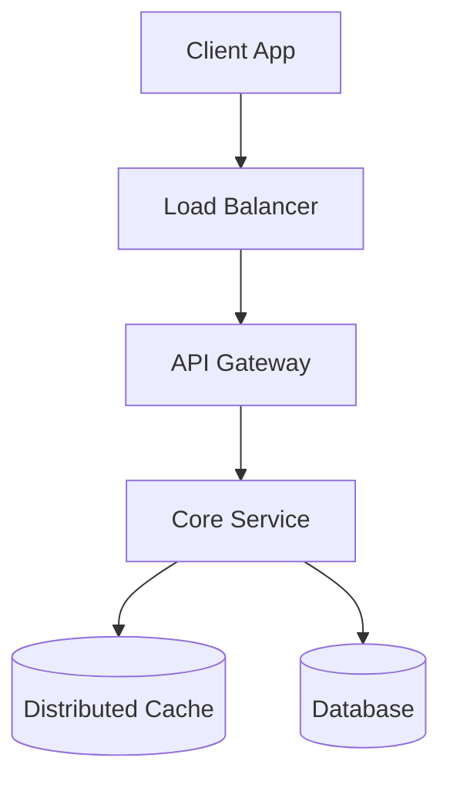

# Overview
[High-level introduction to the system]

## 1. Requirements
### Functional
- [Requirement 1]
- [Requirement 2]

### Non-Functional
- [High Availability / Consistency / Latency]
- [Scale expectations]

## 2. API Design
[Markdown tables or code blocks for endpoints]

## 3. Capacity Estimation
[Back-of-the-envelope calculations]

## 4. High-Level Architecture

[Description of the main components and data flow]

## 5. Detailed Component Design
[Deep dive into storage, hashing, or specific services]

## 6. Trade-offs & Future Scaling
[Why these choices? What are the limitations?]

---
*This architectural deep-dive was collaboratively designed by the user and the System Design Architect AI skill through a structured 6-step interactive process.*
